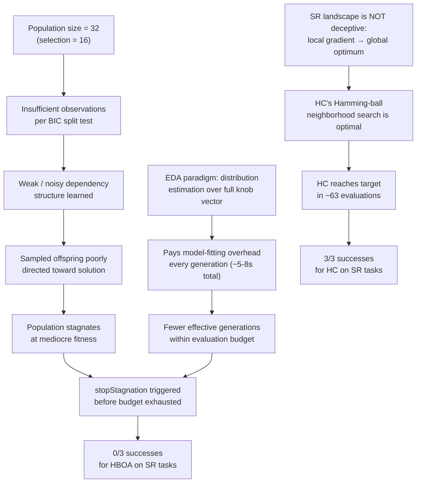

# Why EDA-Based HBOA Performs Worse Than HC for Symbolic Regression

## Executive Summary

The benchmark data is unambiguous: HBOA uses **300–446 more evaluations** than HC to reach targets on symbolic regression (`sr-interaction`, `sr-quartic-interaction`) and **still fails every trial** (0/3 successes). HC succeeds consistently (3/3 at ~63 calls). The root causes span three compounding layers: the **wrong search paradigm**, a **population too small to learn meaningful dependencies**, and **expensive structure-learning overhead** that consumes the evaluation budget without payoff.

---

## 1. The Evidence: Benchmark Data

### Step 13 Comparison Results (SR cases)

| Case | Metric | HC | HBOA | HBOA − HC |
|---|---|---|---|---|
| `sr-quartic-interaction` | Success rate | **3/3 (100%)** | 0/3 (0%) | — |
| `sr-quartic-interaction` | Median evaluations | ~63 | ~434 | **+371** |
| `sr-quartic-interaction` | Wall seconds | ~7s | ~33s | **+26s** |
| `sr-quartic-interaction` | Model fitting seconds | ~0 | ~7s | **+7s overhead** |
| `sr-interaction` | Success rate | **3/3 (100%)** | 0/3 (0%) | — |
| `sr-interaction` | Median evals (total) | ~63 | ~437 | **+374** |
| `sr-interaction` | Wall seconds | ~5.5s | ~21s | **+15.8s** |

HC stops at target reached (`stopTargetReached`). HBOA stagnates (`stopStagnation` 4/5 times) and exhausts the budget (1/5) — it never finds a solution.

---

## 2. Root Cause 1 — Wrong Search Paradigm for Continuous Knobs

HC (hill climbing) and HBOA/EDA operate fundamentally differently:

```
HC:   center → sample Hamming neighbors → score → improve center → repeat
HBOA: population of N candidates → select M → fit dependency model → sample new candidates → replace population
```

**HC is gradient-following in knob space.** For symbolic regression, the representation consists of continuous tree knobs — depth-limited affine coefficients and scaffold structure bits. HC uses the representation structure directly:
- Evaluates neighbors at distance 1 (single knob flip/step)
- If improvement found → recenters, repeats
- Uses widening search (`hcWidenSearch=true`) for deeper neighborhood sweeps
- Uses crossover to jump between good partial solutions

This is a **greedy local search** that exploits the implicit gradient in the knob space very efficiently. On these SR problems, the solution is nearby in knob space from the initial exemplar.

**HBOA treats the search as a black-box distribution estimation problem.** It collects a population, fits a Bayesian network (dependency DAG + decision-tree local models) over the **entire knob vector**, then samples from that learned distribution. This is designed for deceptive problems where local gradient is misleading — not for continuous SR where the knob space has smooth, exploitable structure.

---

## 3. Root Cause 2 — Population Size Is Too Small for Reliable Dependency Learning

This is your key hypothesis, and the data strongly supports it.

### The configuration

From [`step13-manifest.json`](file:///C:/Users/KirA/Desktop/iCog/metta-moses/tests/fixtures/continuous/step13-manifest.json#L57-L79):

```json
"edaPopulationSize": 32,
"edaSelectionSize": 16,
"hboaMinSupport": 2,
"hboaMaxParents": 3,
"hboaMaxDepth": 3,
"hboaMaxLeaves": 8
```

### Why 32 is insufficient

The HBOA dependency model is built in [`structure-learning.metta`](file:///C:/Users/KirA/Desktop/iCog/metta-moses/optimization/hboa/structure-learning.metta). The BIC-scored split search works as follows:

1. **`hboaRoot`** — initializes each knob node with counts of observed values
2. **`hboaSplit`** — tests a parent–child split using BIC:

```
gain = LL(yes-branch) + LL(no-branch) - LL(parent) - 0.5 * (cardinality-1) * log(n)
```

The **BIC penalty** `0.5 * (card-1) * log(n)` grows with log of **active observations `n`**. With population 32 and selection size 16, each generation has at most **16 selected candidates** feeding the model fit. The BIC penalty at n=16 is:

```
penalty = 0.5 * (card - 1) * log(16) ≈ 0.5 * (card-1) * 2.77
```

For a binary knob (card=2) this is ~1.39 nats per split. Any dependency that doesn't produce at least that much log-likelihood gain gets **rejected as noise**. 

The result: with only 16 observations, statistical power is extremely low. The confidence interval on any conditional probability `P(child=v | parent=v')` is enormous. The model either:
- Rejects all splits → degenerates to univariate (no dependencies learned)
- Accepts spurious splits → learns false dependencies that mislead sampling

Looking at the benchmark data confirms this — HBOA learned at most 1 edge and 62 parameters in the `sr-quartic-interaction` case. This is barely more than a univariate model, confirming that the small population is insufficient to identify the true interactions.

### The `hboaMinSupport` guard

```metta
(if (or (< (List.length $yes) $minimum) (< (List.length $no) $minimum)) ()
```

`hboaMinSupport=2` means both branches of a split need at least 2 observations. With 16 selected candidates and, say, a 3-way knob, some branches may have 0–1 observations and the split is vetoed. **This guard is necessary for correctness but further limits what can be learned from a small population.**

### The theoretical requirement

For EDA/HBOA to correctly learn a k-variable dependency structure with population n, the general rule of thumb (from the original BOA/hBOA literature by Pelikan et al.) is:

```
n ≥ C * 2^k * log(m)
```

where `k` is the maximum number of parents, `m` is the number of variables, and `C` is a constant ≥ 2. With `hboaMaxParents=3`, `m = ~dozens of knobs`, and `C=2`:

```
n ≥ 2 * 8 * log(50) ≈ 2 * 8 * 3.9 ≈ 62
```

The **minimum population should be ~64–100** to reliably learn 3-parent interactions. The current setting of 32 (with only 16 selected) is **roughly half the minimum**. This is a classic "EDA starvation" scenario.

---

## 4. Root Cause 3 — Model Fitting Overhead Wastes the Evaluation Budget

The BIC structure search in [`structure-learning.metta`](file:///C:/Users/KirA/Desktop\iCog\metta-moses\optimization\hboa\structure-learning.metta#L39-L57) runs:
- `hboaMaxIterations=16` refinement rounds
- `hboaMaxScoreCalls=256` candidate scoring calls **per fit** 
- `hboaFitTimeLimitSec=10` wall-time cap

The benchmark shows model fitting consumed **5.8–8.0 seconds** per run on `sr-quartic-interaction`. But the **total evaluation budget is `maxEvals=500`**. 

The problem is that HBOA pays a **fixed cost per generation** regardless of quality:

```
Generation cost = select(16) + fit_model(16 obs) + sample_offspring(16) + replace(pop=32)
```

With `edaOffspringSize=16` and `edaPopulationSize=32`, each generation burns:
- ~16 new evaluations 
- Several seconds of model fitting

The budget of 500 evaluations → ~31 generations. But each model is fit on only 16 points, so the learned structure is **always noisy**. HC, by contrast, pays zero model-fitting overhead and directs every evaluation at a promising neighbor.

The `stopStagnation` diagnostic (HBOA stagnates in 4 of 5 SR cases) confirms: the population converges prematurely to a mediocre solution and the noisy dependency model cannot bootstrap diversity to escape it.

---

## 5. Root Cause 4 — The Search Space Topology Favors HC

HC's exploitation of **Hamming-ball neighborhoods** is particularly effective here because:

1. The SR knob space for `continDepth=2, continExpansion=2, continPolyDegree=2` is relatively low-dimensional (few knobs per representation)
2. HC uses widened search (`hcWidenSearch=true`) — when distance-1 fails, it sweeps distance 2, 3, 4
3. HC employs crossover after stagnation — it recombines the top-scoring partial solutions in the deme, which effectively does a population-level recombination without needing an explicit probability model
4. The affine coefficient knobs in MOSES have structured increments (`continStep=1`) — a gradient hill-climb in this space is naturally efficient

EDA/HBOA was designed for **deceptive combinatorial problems** (trap functions, HIFF, parity) where the local gradient is actively misleading. For these, the ability to model and exploit global dependencies is essential. For SR, **the landscape is not deceptive** — local improvements generalize globally, so HC's greedy policy pays off.

---

## 6. Comparison With BOA's Behavior

Interestingly, BOA (a simpler conditional-probability table model) also fails SR (0/3) but with much higher computational cost than HBOA. The `sr-quartic-interaction:hboa-minus-boa` delta shows:
- HBOA uses similar evaluations to BOA (delta median = -37, so slightly fewer)
- But HBOA is **10–14 seconds faster** (negative wall-time delta) because BOA's conditional probability tables are more expensive than HBOA's decision trees

So HBOA does dominate BOA on SR. But both EDA variants are dominated by HC because the **paradigm mismatch** (distribution estimation vs. local gradient search) is the primary issue, not the model complexity.

---

## 7. Summary of Failure Cascade



---

## 8. Recommendations to Improve HBOA on Symbolic Regression

### 8.1 Increase Population Size (Primary Fix)

| Parameter | Current | Recommended |
|---|---|---|
| `edaPopulationSize` | 32 | 100–200 |
| `edaSelectionSize` | 16 | 50–100 |
| `edaOffspringSize` | 16 | 50–100 |
| `hboaMinSupport` | 2 | 4–5 |

This addresses the core statistical starvation problem. With 100 selected candidates, BIC splits become reliable and the learned DAG actually reflects real dependencies.

> [!IMPORTANT]
> Increasing population size multiplies the evaluation cost per generation. Compensate by also increasing `maxEvals` or `optimizerTimeLimitSec`.

### 8.2 Increase Evaluation Budget

With the current `maxEvals=500`, HBOA gets only ~31 generations — too few to converge even with correct dependency learning. With a larger population (100), you'd get only 5 generations. The budget should scale with population:

```
recommended_maxEvals ≥ edaPopulationSize * 10  →  1000–2000 for pop=100
```

### 8.3 Consider RTR Replacement for SR

The current manifest uses `edaReplacement=auto` which selects `rtr` (restricted tournament replacement) for HBOA. RTR preserves diversity by replacing the closest (by Hamming distance) incumbent rather than random. This is good but may need a larger `edaRTRWindow`:

```json
"edaRTRWindow": 16  // instead of 8
```

### 8.4 Hybrid Approach: HC Initialization + HBOA Refinement

The most pragmatic fix: run HC first to find a good region of the search space, then seed HBOA's initial population from the HC deme. HBOA would then only need to model dependencies among the top-k HC solutions — a much smaller and better-conditioned problem.

### 8.5 Lower `hboaMinSupport` Is Not the Answer

Reducing `hboaMinSupport` from 2 to 1 would allow more splits, but with even fewer observations per branch, the learned structure would be more noisy, not less. This would likely make things worse.

---

## 9. Files Referenced

| File | Role |
|---|---|
| [`optimization/hboa/hboa.metta`](file:///C:/Users/KirA/Desktop/iCog/metta-moses/optimization/hboa/hboa.metta) | HBOA optimizer entry point, sampling loop |
| [`optimization/hboa/structure-learning.metta`](file:///C:/Users/KirA/Desktop/iCog/metta-moses/optimization/hboa/structure-learning.metta) | BIC-scored DAG search (`hboaScan`, `hboaSplit`, `hboaSearch`) |
| [`optimization/hboa/local-structure.metta`](file:///C:/Users/KirA/Desktop/iCog/metta-moses/optimization/hboa/local-structure.metta) | Decision-tree local models, `hboaRoot`, `hboaWeights` |
| [`optimization/eda/population.metta`](file:///C:/Users/KirA/Desktop/iCog/metta-moses/optimization/eda/population.metta) | Shared EDA population engine (selection, replacement, stagnation) |
| [`optimization/hillclimbing/hill-climbing-helpers.metta`](file:///C:/Users/KirA/Desktop/iCog/metta-moses/optimization/hillclimbing/hill-climbing-helpers.metta) | HC neighborhood estimation, crossover, iteration loop |
| [`tests/fixtures/continuous/step13-manifest.json`](file:///C:/Users/KirA/Desktop/iCog/metta-moses/tests/fixtures/continuous/step13-manifest.json) | SR benchmark configuration (pop=32, budget=500) |
| [`docs/benchmarks/step13-comparison-results/summary.json`](file:///C:/Users/KirA/Desktop/iCog/metta-moses/docs/benchmarks/step13-comparison-results/summary.json) | Actual benchmark results |
